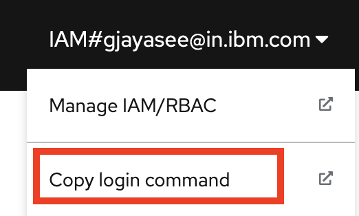

# Cloud Pak for Integration - Automation for AWS, Azure, and IBM Cloud

  

### Change Log

-  **06/2022** - Initial Release

  
> This collection of Cloud Pak for Integration terraform automation layers has been crafted from a set of [Terraform modules](https://modules.cloudnativetoolkit.dev/) created by the IBM GSI Ecosystem Lab team part of the [IBM Partner Ecosystem organization](https://www.ibm.com/partnerworld/public?mhsrc=ibmsearch_a&mhq=partnerworld). Please contact **Matthew Perrins**  _mjperrin@us.ibm.com_, **Sean Sundberg**  _seansund@us.ibm.com_, **Andrew Trice**  _amtrice@us.ibm.com_, **Gowdhaman Jayaseelan**  _gjayasee@in.ibm.com_, **Vijay K Sukthankar**  _vksuktha@in.ibm.com_ or **Jyoti Rani**  _jyotirani10@in.ibm.com_ for more details or raise an issue on the repository.

  
The automation will support the installation of Cloud Pak for Integration on three cloud platforms (AWS, Azure, and IBM Cloud). As an initial effort it was decided to choose the key & essential capabilities such as Integration PlatformNavigator, API connect, App Connect Enterprise, Mq, EventStreams of Cloud Pak for Integration.

⚠️`IMPORTANT: Please be noted. In this release, the focus is only on key/essential cabilities like PlatformNavigator, IBM APIConnect, IBM APPConnect, IBM Event Streams & IBM MQ. In future release, other capabilities like IBM Aspera, IBM DataPower, AssetRepo & OperationDashboard will be considered based on the customer or partner needs.` ⚠️
  
### Releases

## Target Infrastructure

The Cloud Pak for Integration - automation assumes you have an OpenShift cluster already configured on your cloud of choice. The supported OpenShift options are [ROSA for AWS](https://aws.amazon.com/rosa/), [ROKS for IBM Cloud ](https://www.ibm.com/cloud/openshift) or OpenShift IPI instances.

Before you start to install and configure Cloud Pak for Integration, you will need to identify what your target infrastructure is going to be. You can start from scratch and use one of the pre-defined reference architectures from IBM or bring your own.

### Reference Architectures

The reference architectures are provided in three different forms, with increasing security and associated sophistication to support production configuration. These three forms are as follows:

- **Quick Start** - a simple architecture to quickly get an OpenShift cluster provisioned
- **Standard** - a standard production deployment environment with typical security protections such as private endpoints, VPN server, key management encryption, etc
- **Advanced** - a more advanced deployment that employs multiple virtual networks to isolate and securely route traffic between the different layers

  
For each of these reference architecture, we have provided a detailed set of automation to create the environment for the software. If you do not have an OpenShift environment provisioned, please use one of these. They are optimized for the installation of this solution.


Note: [Cloud Pak for Integration system requirements](https://www.ibm.com/docs/en/cloud-paks/cp-integration/2021.4?topic=planning-system-requirements) recommend at least 3 worker nodes, with minimum 16vCPU per node and minimum 64 GB RAM per done (128 GB RAM is recommended).

  
| Cloud Platform                          | Automation and Documentation                                                                                                                                                                                                                                              |   
|-----------------------------------------|---------------------------------------------------------------------------------------------------------------------------------------------------------------------------------------------------------------------------------------------------------------------------|
| [IBM Cloud](https://cloud.ibm.com)      | [IBM Cloud Quick Start](https://github.com/IBM/automation-ibmcloud-infra-openshift) <br /> [IBM Cloud Standard - Coming soon](https://github.com/IBM/automation-ibmcloud-infra-openshift) <br /> [IBM Cloud Advanced - Coming soon](https://github.com/IBM/automation-ibmcloud-infra-openshift) |  
| [AWS](https://aws.amazon.com/)          | [AWS Quick Start - Coming soon](https://github.com/IBM/automation-aws-infra-openshift) <br /> [AWS Standard - Coming soon](https://github.com/IBM/automation-aws-infra-openshift) <br /> [AWS Advanced - Coming soon](https://github.com/IBM/automation-aws-infra-openshift) |
| [Azure](https://portal.azure.com/#home) | [Azure Quick Start - Coming soon](https://github.com/IBM/automation-azure-infra-openshift) <br /> [Azure Standard - Coming soon](https://github.com/IBM/automation-azure-infra-openshift) <br /> [Azure Advanced - Coming soon](https://github.com/IBM/automation-azure-infra-openshift) |                                                                                             | 
| Bring Your Own Infrastructure           | You will need a cluster with at least 16 CPUs and 64 GB of memory per node and at least 3 nodes to support storage and IBM Cloud Paks.                                                          

## Getting Started

Within this repository you will find a set of Terraform template bundles that embody best practices for provisioning the Cloud Pak for Integration in multiple cloud environments. This `README.md` describes the SRE steps required to provision the CP4I software.

This suite of automation can be used for a Proof of Technology environment, or used as a foundation for production workloads with a fully working end-to-end cloud-native environment. The software installs using **GitOps** best practices with [**Red Hat Open Shift GitOps**](https://docs.openshift.com/container-platform/4.8/cicd/gitops/understanding-openshift-gitops.html)

### Integration Architecture

The following reference architecture represents the logical view of how CP4I works after it is installed. CP4i is deployed with either Portworx or OpenShift Data Foundation storage, within an OpenShift Cluster, on the Cloud provider of your choice.


## Deploying Cloud Pak for Integration

The following instructions will help you install Cloud Pak for Integration into AWS, Azure, and IBM Cloud OpenShift Kubernetes environment.

### Licenses and Entitlements

Details on Cloud Pak for Integration licensing available at https://www.ibm.com/docs/en/cloud-paks/cp-integration/2021.4?topic=planning-licensing

### Obtaining your IBM entitlement API key
To install Cloud Pak for Integration you are required to have an entitlement key that provides access to the software components. After the necessary entitlements have been granted, use the following steps to download the entitlement key and apply it to the automation:

1. Visit the Container Software Library site - https://myibm.ibm.com/products-services/containerlibrary
2. Log in with your IBMId credentials
3. Assuming the entitlements are in place, you will be presented with an entitlement key. Click "Copy key".
4. Open your "credentials.template" file and paste the entitlement key in for the value of `TF_VAR_entitlement_key`


###  Cloud Pak for Integration for Multi Cloud
The Integration capabilities automation is broken into what we call layers of automation or bundles. The bundles enable SRE activities to be optimized. The automation is generic between clouds other than configuration storage options, which are platform specific.

 
|  BOM ID| Name      | Description  | Runtime  | 
|--|--|--|--|
| 200 | [200 - OpenShift Gitops](https://stackedit.io/200-openshift-gitops) | Set up OpenShift GitOps tools in an OpenShift cluster. This is required to install the software using gitops approaches. | 10Mins |
 |210|[210 - IBM Portworx Storage](https://stackedit.io/210-ibm-portworx-storage)<BR>[210 - IBM OpenShift Data Foundation](https://stackedit.io/210-ibm-odf-storage)<Br> [210 - AWS Portworx Storage](https://stackedit.io/210-aws-portworx-storage)<BR>[210 - Azure Portworx Storage](https://stackedit.io/210-azure-portworx-storage)|Use this automation to deploy a storage solution for your cluster._⚠️Portworks on AWS and Azure are currently not released, but are coming soon.⚠️_ |10 Mins|
 |215|[215 - Integration Platform Navigator](https://github.com/IBM/automation-integration-platform/blob/draft/215-integration-platform-navigator)|_(MustRequire)_ Install integration Platform Navigator Operator & Instance into the cluster|45Mins|
|220|[220 - Integration API Connect](https://github.com/IBM/automation-integration-platform/blob/draft/220-integration-apiconnect)|_(Optional)_ Install API Connect Operator & Instance into the cluster|30Mins|
|230|[230 - Integration MQ](https://github.com/IBM/automation-integration-platform/blob/draft/230-integration-mq)|_(Optional)_ Install IBM MQ Operator & Instance into the cluster|10Mins|
| 240 | [240 - Integration App Connect Enterprise](https://github.com/IBM/automation-integration-platform/blob/draft/240-integration-ace) | _(Optional)_ Install IBM ACE Operator & ACE Designer Instance into the cluster | 20 Mins |
| 250 | [250 - Integration EventStreams](https://github.com/IBM/automation-integration-platform/blob/draft/250-integration-eventstreams) | _(Optional)_ Install IBM EventStreams Operator & Instance into the cluster | 10 Mins |
| 260 | [260 - Integration MQ Uniform Cluster](https://github.com/IBM/automation-integration-platform/blob/draft/260-integration-mq-uniform-cluster) | _(Optional)_ Install IBM MQ Uniform Cluster Instance into the cluster | 10 Mins |
| 280 | [280 - Cloud Pak for Integration](https://github.com/IBM/automation-integration-platform/blob/draft/280-integration-platform-multicloud) | Deploy the Cloud Pak for Integration components (Platform Navigator/APIConnect/ACE/Event Streams/MQ <BR> **Pls Note: <br> ⚠️If you choose to go with BOM ID: 280 then please ignore BOM ID 215/220/230/240/250/260 because 280 contains all the components of Cloud Pak for Integration ⚠️**| 90 to 100 Mins |


## Installation Steps

> At this time the most reliable way of running this automation is with Terraform in your local machine either through a bootstrapped container image or with native tools installed. We provide a Container image that has all the common SRE tools installed. [CLI Tools Image,](https://quay.io/repository/ibmgaragecloud/cli-tools?tab=tags) [Source Code for CLI Tools](https://github.com/cloud-native-toolkit/image-cli-tools)
Before you start the installation please install the pre-req tools on your machine.

Before you start the installation please install the pre-req tools on your machine.


### Pre-Req Setup
Please install the following Pre-Req tools to help you get started with the SRE tasks for installing Cloud Pak for Integration into an existing OpenShift Cluster on AWS, Azure, or IBM Cloud.

#### MacOS environment

Pre-requisites:
- Check you have a valid GitHub ID that can be used to create a repository in your own organization [GitHub]( https://github.com/) or GitHub Enterprise account.
- Install a code editor. We recommend [Visual Studio Code](https://code.visualstudio.com/)
- Install [Brew](https://brew.sh/)
- Install [Colima](https://github.com/abiosoft/colima) (a replacement for Docker Desktop ) and the **docker** cli
   ```shell
   brew install colima docker
   ```

Ensure the following before continuing
- Github account exists
- A Github [token](https://docs.github.com/en/enterprise-server@3.3/authentication/keeping-your-account-and-data-secure/creating-a-personal-access-token) is available with permissions set to create and remove repositories
- You are able to login to the OpenShift cluster and obtain an OpenShift login token
- Cloud Pak entitlement key, this can be obtained from visiting the [IBM Container Library](https://myibm.ibm.com/products-services/containerlibrary)

### Installing Integration Platform

The installation process will use a standard GitOps repository that has been built using the Modules to support CP4I platform installation. The automation is consistent across three cloud environments AWS, Azure, and IBM Cloud.

#### (optional) Set up the container environment

A container image is used to provide a consistent runtime environment for the automation that includes all the required tools. The provided container image supports hosts with either amd64 and amd64 architectures. If you do not have a container runtime already (e.g. Docker Desktop or podman), **Colima** can be used. The steps to install and start **Colima** on MacOS are provided below:

1. Install **Colima** and the **docker** cli. This only needs to be done once.

    ```shell
    brew install colima docker
    ```

2. Start **Colima**. This needs to be done after each time the computer is restarted. (The first time **Colima** is started takes longer to prepare the environment.)

    ```shell
    colima start
    ```
#### Set up environment credentials

1. First step is to clone the automation code to your local machine. Run this git command in your favorite command line shell.

	```
	git clone git@github.com:IBM/automation-integration-platform.git
	```
2. From the command line, navigate into the `automation-integration-platform` folder from the command line

    a. The README.md has a comprehensive instructions on how to install this into other cloud environments than TechZone. This document focuses on getting it running in a TechZone requested environment.

	```
	cd automation-integration-platform
	```

3. Next you will need to set-up your credentials.properties file. This will enable secure access to your cluster.

    ```shell
    cp credentials.template credentials.properties
    code credential.properties
    ```

    ```text
    ## Add the values for the Credentials to access the OpenShift Environment
    ## Instructions to access this information can be found in the README.MD
    ## This is a template file and the ./launch.sh script looks for a file based on this template named credentials.properties
    
    ## gitops_repo_host: The host for the git repository
    TF_VAR_gitops_repo_host=github.com
    ## gitops_repo_username: The username of the user with access to the repository
    TF_VAR_gitops_repo_username=
    ## gitops_repo_token: The personal access token used to access the repository
    TF_VAR_gitops_repo_token=
    
    ## TF_VAR_server_url: The url for the OpenShift api server
    TF_VAR_server_url=
    ## TF_VAR_cluster_login_token: Token used for authentication to the api server
    TF_VAR_cluster_login_token=
    
    ## TF_VAR_entitlement_key: The entitlement key used to access the IBM software images in the container registry. Visit https://myibm.ibm.com/products-services/containerlibrary to get the key
    TF_VAR_entitlement_key=
    
    ## TF_VAR_ibmcloud_api_key: IBM Cloud API Key required to provision storage on IBM Cloud
    TF_VAR_ibmcloud_api_key=

    ##
    ## Azure credentials
    ## Credentials are required to install Portworx on an Azure account. These credentials must have
    ## particular permissions in order to interact with the account and the OpenShift cluster. Use the
    ## provided `azure-portworx-credentials.sh` script to retrieve/generate these credentials.
    ##
    
    ## TF_VAR_azure_subscription_id: The subscription id for the Azure account. This is required if Azure portworx is used
    TF_VAR_azure_subscription_id=
    ## TF_VAR_azure_tenant_id: The tenant id for the Azure account. This is required if Azure portworx is used
    TF_VAR_azure_tenant_id=
    ## TF_VAR_azure_client_id: The client id of the user for the Azure account. This is required if Azure portworx is used
    TF_VAR_azure_client_id=
    ## TF_VAR_azure_client_secret: The client id of the user for the Azure account. This is required if Azure portworx is used
    TF_VAR_azure_client_secret=
    ```

 4. You will need to populate these values. Add your Git Hub username and your Personal Access Token to `TF_VAR_gitops_repo_username` and `TF_VAR_gitops_repo_token`.

 5. From you OpenShift console click on top right menu and select Copy login command and click on Display Token

    
      
  
 6. Copy the API Token value into the `cluster_login_token` value and Server URL into the `server_url` value, only the part starting with https

    

 7. Copy the entitlement key, this can be obtained from visiting the [IBM Container Library](https://myibm.ibm.com/products-services/containerlibrary) and place it in the `entitlement_key` variable.


##### Deploying on IBM Cloud (Portworx or ODF)

1. Provide the IBM Cloud API Key for the target IBM Cloud account as the value for `TF_VAR_ibmcloud_api_key`

##### Deploying on Azure (Portworx)

If Cloud Pak for Integration will be deployed on OpenShift deployed on Azure, the credentials for the Azure account need to be
provided. Several clis are required for these steps:

- `az` cli - https://docs.microsoft.com/en-us/cli/azure/install-azure-cli
- `jq` cli - https://stedolan.github.io/jq/download/

You can install these clis on your local machine **OR** run the following commands within the provided container image by running `launch.sh` 

1. Log into your Azure account

    ```shell
    az login
    ```

2. Run the `azure-portworx-credentials.sh` script to gather/create the credentials:

    ```shell
    ./azure-portworx-credentials.sh -t {cluster type} -g {resource group name} -n {cluster name} [-s {subscription id}]
    ```

    where:
    - **cluster type** is the type of OpenShift cluster (`aro` or `ipi`).
    - **resource group name** is the name of the Azure resource group where the cluster has been provisioned.
    - **cluster name** is the name of the OpenShift cluster.
    - **subscription id** is the subscription id of the Azure account. If a value is not provided it will be looked up.

3. Update `credentials.properties` with the values output from the script.

    ```json
    {
      "azure_client_id": "XXXXXXXX-XXXX-XXXX-XXXX-XXXXXXXXXXXX",
      "azure_client_secret": "XXXXXXX",
      "azure_tenant_id": "XXXXXXXX-XXXX-XXXX-XXXX-XXXXXXXXXXXX",
      "azure_subscription_id": "XXXXXXXX-XXXX-XXXX-XXXX-XXXXXXXXXXXX"
    }
    ```

4. If you used the container image to run the script, type `exit` to close the container shell then re-rung `launch.sh` to pick up the changes to the environment variables.

#### Configure the automation

##### Get the Portworx configuration spec (for AWS or Azure deployments)

1. Follow the steps to download the [portworx confituration spec](./PORTWORX_CONFIG.md)
2. Copy the downloaded file into the root directory of the cloned automation-maximo-app-suite repository

##### Set up the automation workspace

1. Next we need to configure the installation of Maximo Core. Run the `launch.sh` command from the root directory of the cloned automation-maximo-app-suite repository

    ```shell
    ./launch.sh
    ```

    ```
    Cleaning up old container: cli-tools-WljCg
    Initializing container cli-tools-WljCg from quay.io/cloudnativetoolkit/terraform:v1.1
    Attaching to running container...
    /terraform $
    ```

2. **launch.sh** will download a container image that contains all the command line tools to enable easy installation of the software. Once it has downloaded, it will mount the local file system and exec into the container for you to start running commands from within this custom container.

   > We expect partners and clients will use their own specific **Continuous Integration** tools to support this the IBM team has focused on getting it installed in the least complicated way possible

3. Next we need to set up the working directory for the automation:

   ```shell
   ./setup-workspace.sh [-p {cloud provider}] [-s {storage}] [-n {prefix name}] [-x {portworx spec file}]
   ```
    
   where:
   - **cloud provider** (optional) - the target cloud provider for the deployment (`aws`, `azure`, or `ibm`)
   - **storage** (optional) - the intended storage provider (`portworx` or `odf`)
   - **prefix name** (optional) - the name prefix that will be used for the gitops repo
   - **portworx spec file** (optional) - the name of the file containing the Portworx configuration spec yaml
    
   **Example:**
   ```shell
   ./setup-workspace.sh -p azure -s portworx -n cp4i-demo -x portworx_essentials.yaml
   ```

4. The `setup-workspace.sh` script configures the `terraform.tfvars` file with reasonable defaults. There are no other changes required in order to run the automation.

     **Note:** 
     The default `terraform.tfvars` file is symbolically linked to the new `workspaces/current` folder so this enables you to edit the file in your native operating system using your editor of choice.

The following are variables that you will be updating. Here are some suggested values.

| Variable                          | Description                                                                                                                                                      | Suggested Value                                       | 
|-----------------------------------|------------------------------------------------------------------------------------------------------------------------------------------------------------------|-------------------------------------------------------
| rwx_storage_class                 | The storage class to use for Read-Write-Many volumes. Use a portworx or odf storage class (e.g. portworx: portworx-rwx-gp3-sc or odf: ocs-storagecluster-cephfs) | portworx-rwx-gp3-sc                                   |
| rwo_storage_class                 | The storage class to use for Read-Write-One volumes.  on aws: `gp2`, on azure: `managed-premium`, on ibm: `ibmc-vpc-block-10iops-tier`                           | ibmc-vpc-block-10iops-tier                            |
| gitops_repo_host                  | The host for the git repository.                                                                                                                                 | github.com                                            |
| gitops_repo_type                  | The type of the hosted git repository (github or gitlab).                                                                                                        | github                                                |
| gitops_repo_org                   | The org/group where the git repository will be created. If the value is left blank then it will default to the username                                          | github userid or org                                  |
| gitops_repo_repo                  | The short name of the repository to create                                                                                                                       | cp4i-gitops                                  |
| gitops-cluster-config_banner_text | Banner text for the cluster console                                                                                                                              | Cloud Pak for Integration                              |
| portworx_spec_file                | The name of the file containing the portworx configuration spec yaml                                                                                             | portworx_essentials.yaml                              |

1. Update the desired values in `terraform.tfvars`
2. Save the `terraform.tfvars` file

#### Apply the automation
1. We are now ready to start installing Cloud Pak for Integration. Ensure you are inside the running container, if not Run the `launch.sh` command. Make sure you are in the root of the automation-integration-platform repository.

    ```shell
    ./launch.sh
    ```
2. Within the container terminal, change directory to the `/workspaces/current` folder. This folder was populated by the `setup-workspaces.sh` script in the previous step. (The `launch.sh` command configures a named volume to preserve the contents of the `/workspaces` directory between container images so you don't need to re-run `setup-workspaces.sh` again unless you want to configure a different environment.)

3. Run `./apply-all.sh` to kick off the automation. The script will apply each layer in order.
Cloud Pak fo Integration deployment will run asynchronously in the background, and may require up to 90 to 100 minutes to complete.

4. You can check the progress by looking at two places, first look in your github repository. You will see the git repository has been created based on the name you have provided. The Cloud Pak for Integration install will populate this with information to let OpenShift GitOps install the software. The second place is to look at the OpenShift console, Click Workloads->Pods and you will see the GitOps operator being installed. 
    You can also check the progress of the deployment by opening up Argo CD (OpenShift GitOps). From the OpenShift user interface, click on the Application menu 3x3 Icon on the header and select **Cluster Argo CD** menu item.)

5. Once deployment is complete, go back into the OpenShift cluster user interface and navigate to view `Routes` for the `cp4i-pn` namespace. Here you can see the URL to the deployed Platform Navigator instance. Open this url in a new browser window.

    

6.  Navigate to `Secrets` in the `ibm-common-services` namespace, and find the `platform-auth-idp-credentials` secret. Copy the value of `password` key inside of that secret.

7. Go back to the PlatformNavigator instance that you opened in a separate window. Log in using the username `admin` with the password copied in the previous step.


## Summary

This concludes the instructions for installing *Cloud Pak for Integration * on AWS, Azure, and IBM Cloud

## Troubleshooting

Please refer to the [Troubleshooting Guide](./TROUBLESHOOTING.md) for uninstallation instructions and instructions to correct common issues.

## How to Generate this repository from teh source Bill of Materials.

This set of automation packages was generated using the open-source [`isacable`](https://github.com/cloud-native-toolkit/iascable) tool. This tool enables a [Bill of Material yaml](https://github.com/cloud-native-toolkit/automation-solutions/tree/main/boms/software/maximo) file to describe your software requirements. If you want up stream releases or versions you can use `iascable` to generate a new terraform module.

> The `iascable` tool is targeted for use by advanced SRE developers. It requires deep knowledge of how the modules plug together into a customized architecture. This repository is a fully tested output from that tool. This makes it ready to consume for projects.
